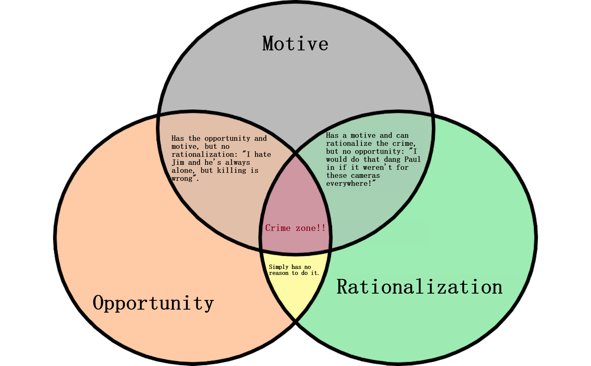

+++
date = '2024-11-21T14:29:59+03:00'
draft = false
title = 'The modeling of lies, slander and other such misconducts in economics.'
tags = [
    "Behavioral finance"
]
categories = [
    "finance",
    "Behavioral finance"
]
nofeed = false
hidden = false
nodate = false
images = ["/img/Window.png"]
imagetext = ""
hidemeta = false
+++

Why do people tell lies, knowing it’s wrong? Well, that’s a complex question, full of moral and ethical pondering. Luckily, like all philosophical and fundamental quandaries of our life, the answer can be found in economics and, in this case, a bit of behavioral modeling. 

The model of todays topic serves as a possible predictor of the likelihood of someone performing misconduct for some sort of personal gain, and approximations of it (with, of course, greatly increased detail) are often used by legislative agencies, regulators and even financial analysts to gauge possible risks of an investment. It is quite intuitive and simple to grasp as well, so it won’t be difficult at all for me to explain, phew!

I am talking about the Fraud Triangle, developed by Donald Cressey in 1950’s, a criminologist studying cases of fraud and embezzlement.  He concluded that embezzlement occurs when three distinct factors are met: opportunity, motive and rationalization. Opportunity standing for how possible the action is, motive for an underlying reason behind it, such as a personal financial disaster requiring urgent funds, and rationalization is how the person, well, rationalizes the decision to themselves, with platitudes such as “Everyone else does it” or “I need to do this to get ahead” and so on.  

While it is called a triangle, I feel that a Venn diagram best showcases the model, portrayed below:

Now, this fraud triangle theorem does quite nicely explain why someone would commit a crime, but it lacks a deterrence factor – the possible punishment for getting caught. While it might be conflated with opportunity, it is still distinct enough to be counted as its own category. If the punishment for a crime is severe enough then it might deter someone from doing it, even if all the three conditions of the fraud triangle are met. This line of thought goes alongside the behavioral finance model of rational choice, which aims to prove that people, to some extent, calculate the benefits, risks and consequences of their actions. If consequences for an action are severe, then rationally it should lower its possibility, right? 

Of course, people are seldom very rational, and what might constitute as a nightmarish punishment to some could hardly faze another. As a matter of fact, this is one of the reasons why various incentive schemes exist to whiff out possible crime, such as protecting and rewarding whistleblowers. Many antitrust oversight agencies employ such schemes with the mentality that sometimes it is better to reward one to catch the rest, rather than simply sublimate them all for punishment if caught.  These rewards can be quite sizeable too, so it can pay out to be the snitch, snitches get riches, as the saying goes. If you are interested, feel free to read more about these possible rewards [here](https://www.sec.gov/enforcement-litigation/whistleblower-program). That’s right, you could become a millionaire from the crimes of others, isn’t that a fantastic deal? Who’s the real sneak in that situation, eh? 

To conclude – while rationalization and motive for crime are something that might be hard to control for a company (unless you can employ some sort of top-of-the-line brainwashing), the opportunity for it is something that they can affect. Keep your doors locked, folders supervised and try to have oversight over every single employee. 

For further reading into recent fun frauds that were caught, why not look into the Enron scandal of 2001, the LIBOR scandal of 2012, or the Volkswagen emission scandal of 2015? What’s interesting about these mishaps is that they’re company wide and in that sense, entirely impersonal, yet they still follow many of the principles of the fraud triangle. Try to compare and contrast and see if you can spot where each element lies.

 

